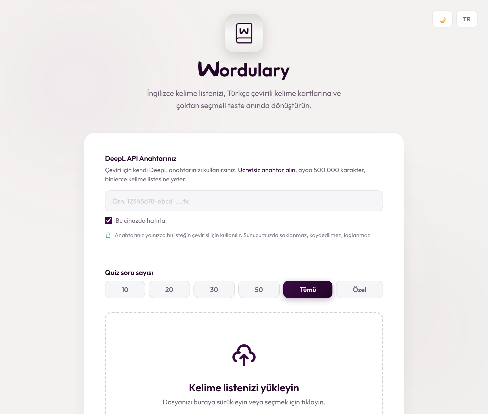

<div align="center">

# Wordulary

**Turn a plain word list into a print-ready vocabulary sheet and a matching quiz, in one drop.**

[](https://www.python.org/)
[](https://fastapi.tiangolo.com/)
[](https://www.deepl.com/pro-api)
[](LICENSE)

**[Try it live → wordulary.gwrlabs.com](https://wordulary.gwrlabs.com)**



</div>

---

## What it does

English teachers spend hours on the same three chores: translating a vocabulary list, formatting it into a handout, and writing a quiz from it. Wordulary collapses all three into a single file drop.

Give it a list of English words. It returns two print-ready A4 PDFs:

| Output | What you get |
| --- | --- |
| **Vocabulary list** | A two-column handout pairing each English word with its Turkish translation, paginated automatically. |
| **Quiz** | A multiple-choice test. Each question's three wrong answers are drawn from your *own* other translations, so every option is plausible. You choose how many questions. |

### What makes the translations good

Bare single words are ambiguous, and most tools get them wrong: `litter` becomes "litre", `mayor` becomes "en büyük", `bail` becomes "Hoşça kal". Coursebook lists mark the part of speech (`litter n.`, `distinguish v.`), and Wordulary **uses that marker** instead of discarding it, telling DeepL which sense you meant. So `litter n.` comes back as "çöp". Lists without markers work fine too.

## Features

- **Bring your own key (BYOK).** The hosted version asks for your own DeepL key, used for that one request and never stored or logged. Self-hosting uses a `.env` key instead.
- **`.txt`, PDF, and Word (`.docx`).** Drop in a coursebook list as-is; the part-of-speech marker anchors word extraction even from multi-column PDFs. Up to 10 MB.
- **Pick the quiz length.** 10, 20, 30, 50, or all of your words. The vocabulary list always covers every word.
- **Sense disambiguation** from part-of-speech markers (above).
- **Light and dark theme**, TR/EN interface.
- **Print-ready PDFs** with a hand-tuned two-column layout; font size auto-fits so a long translation never spills into the next column.

## How it works

```
upload (.txt / .pdf / .docx)
   └─ extract (word, part of speech)
   └─ DeepL EN→TR, grouped by POS, batched
   └─ Vocabulary list PDF  +  Quiz PDF (with plausible distractors)
```

- **Backend**: [FastAPI](https://fastapi.tiangolo.com/), serving the API and the static frontend from one process. Translation and PDF work run in a threadpool so one slow job never blocks the server.
- **Translation**: the official [DeepL client](https://github.com/DeepLcom/deepl-python), chosen over cheaper engines because vocabulary-level accuracy *is* the product. Words are grouped by part of speech and each group is batched with a context that names the word type.
- **Extraction**: `.txt` is read line by line; PDF (via [pypdf](https://pypdf.readthedocs.io/)) and Word (via [python-docx](https://python-docx.readthedocs.io/)) anchor on the POS marker to separate words from pronunciation, definitions, and page noise.
- **PDF generation**: [FPDF](https://pyfpdf.github.io/fpdf2/) with a manual two-column layout and DejaVu Sans (open-licensed, full Turkish coverage), paginated with auto-fit font sizing.
- **Frontend**: vanilla HTML/CSS/JS. No build step, no framework, no `node_modules`.

### Project layout

```
Wordulary/
├── app.py                       # FastAPI app: routes, upload handling, BYOK, static mount
├── main.py                      # Legacy Tkinter desktop entry point (superseded by app.py)
├── src/
│   ├── extract_words.py         # .txt / .pdf / .docx  ->  (word, part-of-speech) pairs
│   ├── read_words_from_txt.py   # .txt line parser (used by extract_words)
│   ├── translate_words.py       # DeepL client: POS-grouped batching, sense disambiguation
│   ├── fonts.py                 # Bundled fonts + auto-fit sizing
│   ├── create_word_list_pdf.py  # Two-column vocabulary handout
│   ├── generate_choices.py      # Pick plausible distractors per question
│   └── create_quiz_pdf.py       # Two-column, paginated quiz sheet
├── static/                      # index.html, privacy.html, style.css, script.js, translations.js, logo
├── fonts/                       # DejaVu Sans (open-licensed)
└── example_txt_files/           # Sample word lists to try
```

## Getting started

### Requirements

- Python 3.10 or newer
- A DeepL API key (the [free tier](https://www.deepl.com/pro-api) covers 500,000 characters a month, thousands of word lists)
- No system fonts needed; DejaVu Sans ships with the repo

### Setup

```bash
git clone https://github.com/TalhaTufanN/wordulary.git
cd wordulary
pip install -r requirements.txt
```

Create a `.env` file in the project root:

```env
DEEPL_API_KEY="your_key_here"
```

> `.env` is git-ignored. Never commit your key.

### Run it

The startup scripts create a virtual environment, install dependencies, launch the server, and open your browser:

```bash
# Windows
start.bat

# macOS / Linux
chmod +x start.sh && ./start.sh
```

Or start the server yourself:

```bash
python -m uvicorn app:app --reload
```

Then open **<http://localhost:8000>**.

### Using it

1. Prepare a list of English words, one per line, in a `.txt`, PDF, or Word file. **At least 4 distinct words** (one correct answer plus three distractors per quiz question). Part-of-speech markers like `v.`, `n.`, `adj.` sharpen the translations.
2. Choose the quiz length.
3. Drop the file onto the upload zone.
4. Download both PDFs. A 60-word list takes about two seconds.

No word list handy? Use the "download a sample list" button on the page, or the files in [`example_txt_files/`](example_txt_files/).

## API

The frontend is a thin client over these endpoints, documented interactively at `/docs` while the server is running.

| Method | Endpoint | Description |
| --- | --- | --- |
| `POST` | `/api/process` | Accepts a `.txt`/`.pdf`/`.docx` upload and a `question_count` form field; returns download URLs for both PDFs. Optional `X-DeepL-Api-Key` header (required when BYOK is on). |
| `GET` | `/api/download/{filename}?type=words\|quizzes` | Serves a generated PDF. |
| `GET` | `/api/config` | Tells the frontend whether a user-supplied key is required. |
| `GET` | `/health` | Liveness check for the reverse proxy. |

BYOK is enabled with the `WORDULARY_REQUIRE_USER_KEY=true` environment variable; unset, the server falls back to the `.env` key.

## License

[MIT](LICENSE) © Talha Tufan

---

<div align="center">
<sub>Built by <a href="https://gwrlabs.com">GWR Labs</a></sub>
</div>
